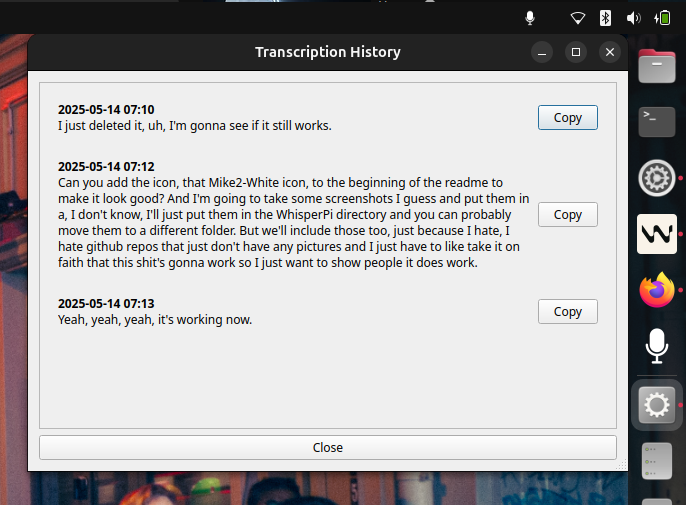

<p align="center">
  
</p>

# Whisper Py Voice Typing

A hands-free, system tray speech-to-text app for Linux (Ubuntu) using OpenAI Whisper API. Hold the hotkey, speak, and have your words transcribed and auto-pasted anywhere.


## Screenshots

<p align="center">
  <br>
  <b>System Tray Menu</b>
</p>
<p align="center">
  <br>
  <b>API Key Settings Window</b>
</p>
<p align="center">
  <br>
  <b>Transcription History Window</b>
</p>

## Features

- Start/stop transcription with simple, fixed hotkeys (see Hotkeys below)
- Transcription via Whisper API
- Clipboard integration and auto-paste
- System tray icon and menu
- Transcription history saved locally (never committed to git)
- Easy setup and API key management via settings dialog
- Full privacy: your API key is never shown or logged, and your history stays on your device

## Hotkeys

- `Alt + ,` (comma): Hold to record, release to finish/transcribe
- `Alt + .` (dot): Tap to toggle recording on/off
- `Alt + /` (slash): Tap to cancel recording/transcription

These hotkeys are hardwired for simplicity and reliability. Also, because I'm fucking done with vibe coding this right now and I just want to stop and go to sleep, so I'm not going to implement being able to edit them.

## Installation

1. **Clone the repo:**

   ```bash
   git clone https://github.com/yourusername/whisper-py.git
   cd whisper-py
   ```
2. **Create a virtual environment:**

   ```bash
   python3 -m venv venv
   source venv/bin/activate
   ```
3. **Install dependencies:**

   ```bash
   pip install -r requirements.txt
   ```
4. **Set up your API key:**

   - Copy `.env.example` to `.env` and add your OpenAI API key.
   - You can also change your API key at any time from the app's Settings menu (your key is never shown or exposed).
5. **Run the app:**

   ```bash
   python whisper-py.py
   ```

## Transcription History

- All transcriptions are saved locally to `transcription_history.json` for your reference.
- This file is automatically excluded from git by default.
- The "History" dialog (from the tray menu) now features:
  - Copy buttons next to each entry for instant copying
  - Compact timestamps
  - Line wrapping for long transcriptions
  - A larger, resizable window for easy browsing

## Optional: Desktop Launcher

To launch from your system menu like any app, see the [Desktop Integration](#desktop-integration) section below.

## Requirements

- Python 3.8+
- Ubuntu (tested), should work on most Linux distros
- OpenAI API key

## Desktop Integration

Want to launch from your system menu? Create a launcher:

1. **Create `launch-whisper.sh`** (already included):

   ```bash
   #!/bin/bash
   PROJECT_DIR="$(cd "$(dirname "$0")" && pwd)"
   cd "$PROJECT_DIR"
   source "$PROJECT_DIR/venv/bin/activate"
   python "$PROJECT_DIR/whisper-py.py" 2>&1 | tee "$PROJECT_DIR/whisper-launch.log"
   ```

   Make it executable:
   ```bash
   chmod +x launch-whisper.sh
   ```
2. **Create a desktop entry:**
   Create `~/.local/share/applications/whisper-py.desktop` with:

   ```ini
   [Desktop Entry]
   Type=Application
   Name=Whisper Py Voice Typing
   Comment=Voice-to-text system tray app
   Exec=/absolute/path/to/launch-whisper.sh
   Icon=/absolute/path/to/mic2-white.png
   Terminal=false
   Categories=Utility;
   ```

   Replace `/absolute/path/to/` with your real paths.
3. **Update the desktop database:**

   ```bash
   update-desktop-database ~/.local/share/applications/
   ```

## Customization

- Change the hotkey in the code if you want.

## License

MIT
